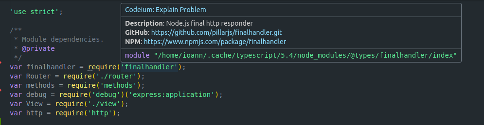

# View NPM import information

Access package descriptions right from your code editor with NPM info. This lightweight extension simplify your coding workflow by allowing you to effortlessly explore package details directly within your code.

Simply hover over imported packages in your code to instantly view concise descriptions. Acquire simple descriptions of each package and links to them.

Package info streamlines your development process by providing essential information at your fingertips, saving you time and effort. Plus, with convenient links to the package's source page on npm or GitHub, you can dive deeper into documentation.

# How to use 

1. Navigate to the line where you `require(...)` or `improt from '...'` the package.

